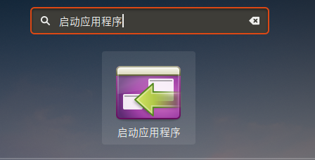
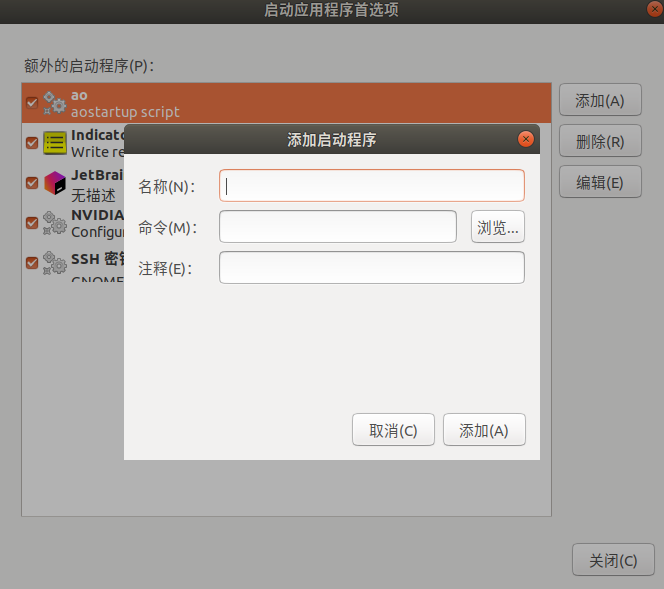
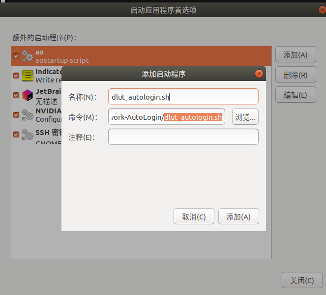
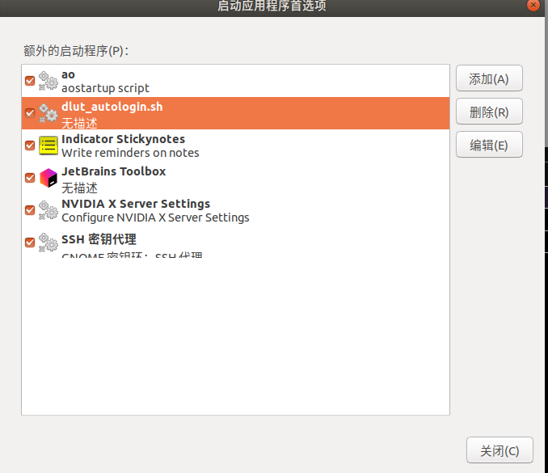

# 大连理工大学自动联网脚本
## Notes
有同学反应无法运行，目前都是应为Chrome-driver的版本。

运行前请使用`pyhton test_version.py`进行测试。

如果这个没问题多半是没问题的。

如果出现版本上的报错，请上网自行查找解决方案。

## requirements
```shell
#必须使用此名的虚拟环境，否则脚本不对应。
conda create -n Network python
conda activate Network

pip install selenium

sudo apt-get install chromium-chromedriver
#最后一条命令如有报错，请自行上网查看解决方案

#验证码版本似乎是不必要的，如需使用请
#记得装pytesseract、pillow和tesseract-ocr
#并取消注释相关代码片段
```
## 在user_passwd.txt中添加你的账号密码
```text
username:22005549
password:6546325s

#严格按照此格式，禁止多换行，多打空格，增加额外注释，此注释不用删除。
```

## how to use
```shell
conda activate Network
python dlut_autologin.py
```

## 关于开机自启
采用图形化的自启模式

1. ubuntu搜索`startup application`或者`启动应用程序`，并点击进入



2.选择`add`或者`添加`



随便取个名字，建议和脚本同名`dlut_autologin.sh`

点击`浏览`，选择对应脚本【即本工程中的dlut_autologin.sh】





并点击`添加`，`关闭`
## 感谢原作者
https://github.com/anruoran/Network-State-Detection-and-AutoLogin